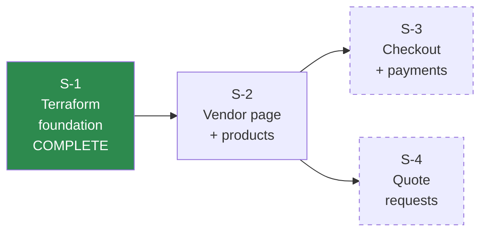
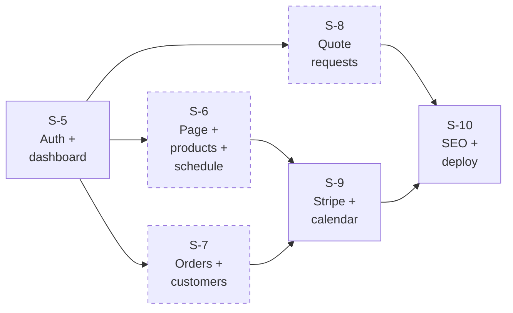
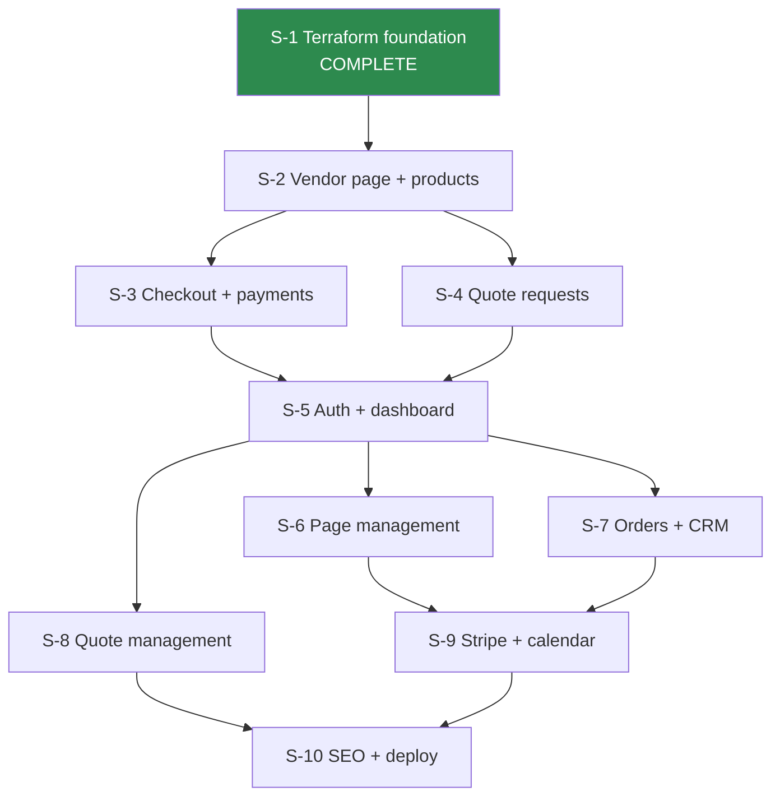
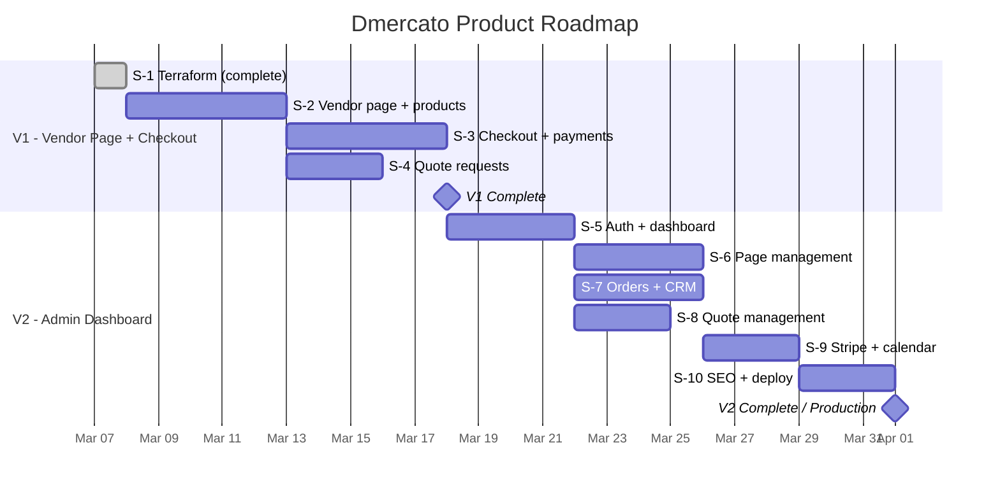

# Roadmap: Dmercato

## Architecture Diagram

```mermaid
graph TB
    subgraph "Client"
        Browser["Browser"]
    end

    subgraph "CDN"
        CF["CloudFront<br/>dmercato.com"]
    end

    subgraph "Compute"
        Renderer["Renderer Lambda<br/>SSR vendor pages<br/>+ product catalogue"]
        API["API Lambda<br/>CRUD + checkout<br/>+ orders + customers"]
        Auth["Auth Lambda<br/>Magic link + sessions"]
        StripeWH["Stripe Webhook Lambda<br/>Payment confirmation<br/>+ order creation"]
        Sitemap["Sitemap Lambda<br/>Scheduled daily"]
        CacheInv["Cache Invalidator<br/>Lambda"]
    end

    subgraph "API Layer"
        APIGW["API Gateway<br/>HTTP API"]
    end

    subgraph "Storage"
        DDB_Tenants["DynamoDB<br/>tenants"]
        DDB_Quotes["DynamoDB<br/>quoteRequests"]
        DDB_Sessions["DynamoDB<br/>sessions"]
        DDB_Magic["DynamoDB<br/>magicLinks"]
        DDB_Orders["DynamoDB<br/>orders"]
        S3_Assets["S3<br/>assets"]
        S3_Admin["S3<br/>admin SPA"]
        S3_Sitemaps["S3<br/>sitemaps"]
    end

    subgraph "Email"
        SES["SES<br/>noreply@dmercato.com"]
    end

    subgraph "Payments"
        Stripe["Stripe Connect<br/>Express accounts<br/>Destination charges"]
    end

    subgraph "Scheduling"
        EB["EventBridge<br/>Daily cron"]
    end

    subgraph "Secrets"
        SSM["SSM Parameter Store"]
    end

    Browser -->|"/{slug}"| CF
    Browser -->|"/api/*"| CF
    Browser -->|"/admin/*"| CF
    Browser -->|"/assets/*"| CF

    CF -->|"default origin"| Renderer
    CF -->|"/api/*"| APIGW
    CF -->|"/admin/*"| S3_Admin
    CF -->|"/assets/*"| S3_Assets
    CF -->|"/sitemap*"| S3_Sitemaps

    APIGW --> API
    APIGW --> Auth
    APIGW --> StripeWH

    Renderer --> DDB_Tenants
    API --> DDB_Tenants
    API --> DDB_Quotes
    API --> DDB_Orders
    API --> S3_Assets
    API --> CacheInv
    API --> Stripe
    API --> SES
    Auth --> DDB_Sessions
    Auth --> DDB_Magic
    Auth --> SES
    StripeWH --> DDB_Orders
    StripeWH --> DDB_Tenants
    StripeWH --> SES

    Stripe -->|"webhook"| APIGW

    CacheInv --> CF

    EB --> Sitemap
    Sitemap --> DDB_Tenants
    Sitemap --> S3_Sitemaps

    Renderer -.->|"cold start"| SSM
    API -.->|"cold start"| SSM
    Auth -.->|"cold start"| SSM
    StripeWH -.->|"cold start"| SSM
```

## Slice Map (10 slices)

### V1 -- Vendor Page + Product Catalogue + Checkout + Quote Form

**Goal:** Oscar's vendor page is live at `dmercato.com/sweet-sin` with a working product catalogue, checkout flow, and quote request form. Customers can buy products and request custom event catering.

**Validation:** Page renders with products and prices. Customer can complete a purchase via Stripe. Quote form delivers email to vendor. Both order receipt and vendor notification emails are sent.

| Slice | Description | Dependencies | Parallel |
|-------|-------------|--------------|----------|
| S-1 | Terraform foundation: DynamoDB tables, S3 buckets, SSM params, IAM roles | None | -- |
| S-2 | A visitor can see a vendor page with product catalogue | S-1 | -- |
| S-3 | A visitor can purchase products and receive a confirmation | S-2 | S-4 |
| S-4 | A visitor can submit a quote request | S-2 | S-3 |



S-3 and S-4 can be built in parallel after S-2 is complete.

### V2 -- Admin Dashboard + Order Management + CRM

**Goal:** Oscar can log in, manage his page and products, view and fulfil orders, manage customers, handle quote requests, connect his Stripe account, and manage market dates.

**Validation:** Vendor can independently manage their entire storefront, process orders, and communicate with customers without developer intervention.

| Slice | Description | Dependencies | Parallel |
|-------|-------------|--------------|----------|
| S-5 | A vendor can log in and see their dashboard | S-3, S-4 | -- |
| S-6 | A vendor can manage their page, products, and schedule | S-5 | S-7, S-8 |
| S-7 | A vendor can view orders and manage customers | S-5 | S-6, S-8 |
| S-8 | A vendor can view and manage their quote requests | S-5 | S-6, S-7 |
| S-9 | A vendor can manage their Stripe account and market calendar | S-6, S-7 | -- |
| S-10 | SEO + sitemap + production deploy | S-8, S-9 | -- |



S-6, S-7, and S-8 can all be built in parallel after S-5 is complete.

## Full Dependency Graph



## Product Roadmap



## Timeline Summary

| Milestone | Estimated Duration | Depends On |
|-----------|-------------------|------------|
| V1 Complete (S-1 through S-4) | ~2 weeks from now | S-1 (done) |
| V2 Complete (S-5 through S-10) | ~2.5 weeks after V1 | V1 complete |
| Production Launch | ~4.5 weeks from now | V2 complete |

## Slice Estimates

| Slice | Estimated Tests | Estimated Effort | Key Risks |
|-------|-----------------|------------------|-----------|
| S-1 | 0 (infra) | Done | -- |
| S-2 | ~20 | 4-5 days | Inline CSS complexity, SSR performance |
| S-3 | ~24 | 4-5 days | Stripe Connect integration, webhook reliability |
| S-4 | ~14 | 2-3 days | SES sandbox limits |
| S-5 | ~28 | 3-4 days | Magic link email delivery |
| S-6 | ~24 | 3-4 days | Photo upload UX, schedule UI complexity |
| S-7 | ~20 | 3-4 days | Customer aggregation query performance |
| S-8 | ~14 | 2-3 days | Low risk (similar patterns to S-7) |
| S-9 | ~14 | 2-3 days | Stripe onboarding redirect flow |
| S-10 | ~14 | 2-3 days | Production deployment verification |

**Total estimated tests:** ~172

## Risk Register

| Risk | Impact | Likelihood | Mitigation |
|------|--------|------------|------------|
| SES sandbox limits block emails | High | Medium | Apply for production SES access early. Use verified emails for testing |
| Stripe Connect onboarding complexity | Medium | Medium | Use Express accounts with Stripe-hosted onboarding (minimal custom UI). Test with Stripe test mode |
| Cold start latency on Renderer Lambda | Medium | Medium | arm64 + small bundle + provisioned concurrency if needed |
| DynamoDB nested data hits 400KB item limit | Low | Low | 50 products + schedule + market dates at ~2KB each = ~100KB, under limit. Monitor item sizes |
| Stripe webhook delivery failures | Medium | Low | Webhook handler is idempotent. Stripe retries for up to 3 days. CloudWatch alarms on webhook errors |
| Customer aggregation query slow at scale | Low | Low | Orders table GSI supports vendor queries. Aggregation is in-memory for < 1000 orders per vendor. Fine for MVP |
| CloudFront cache serves stale vendor data | Medium | Low | 60s TTL + explicit invalidation on write. Acceptable staleness window |
| Vendor adoption below expectations | High | Medium | Product risk, not technical. Focus on Oscar as lighthouse customer |
| Magic link emails land in spam | Medium | Medium | DKIM + SPF + DMARC via SES domain verification. Simple text emails |
| Cart state lost on page reload | Low | Low | Cart persisted in localStorage. Survives page reload. Cleared on successful checkout |

## Post-MVP Roadmap

These features are planned for after the MVP 10-slice scope is validated:

| Feature | Prerequisite | Estimated Effort |
|---------|-------------|------------------|
| Marketplace homepage + city pages | Vendor density (5+ vendors) | 2 weeks |
| Search | Vendor volume (50+ vendors) | 1 week |
| Custom domains | Revenue model validated | 3 weeks |
| Subscription billing | Platform fee model decided | 1 week |
| Photo resize pipeline | Performance data showing need | 3 days |
| Vendor analytics | Multiple vendors active | 2 weeks |
| Discount codes | Purchase volume data | 1 week |
