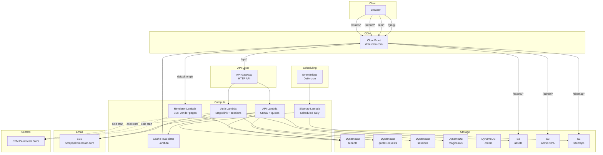
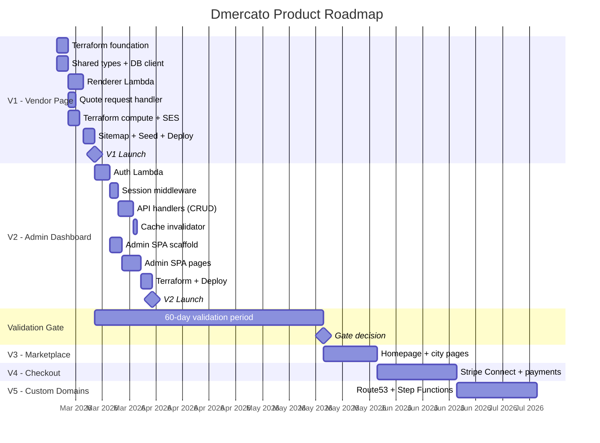

# Roadmap: Dmercato

## Architecture Diagram

## Milestones

### V1 -- Vendor Page + Quote Form

**Goal:** Oscar's vendor page is live at `dmercato.com/sweet-sin`, fully indexed by Google, with a working quote form.

**Validation:** Page renders with full SEO, quote form delivers email to vendor.

| Slice | Description | Dependencies |
|-------|-------------|--------------|
| V1-S1 | Terraform foundation: DynamoDB tables, S3 buckets, SSM params, IAM roles | None |
| V1-S2 | Shared types package (`packages/shared/types/`) | None |
| V1-S3 | DynamoDB client + tenant read helpers (`packages/shared/db/`) | V1-S2 |
| V1-S4 | Renderer Lambda: SSR vendor page with inline CSS, SEO meta, JSON-LD | V1-S2, V1-S3 |
| V1-S5 | Terraform compute: Renderer Lambda, API Gateway, CloudFront distribution | V1-S1 |
| V1-S6 | Quote request handler: validation, DynamoDB write, SES notification | V1-S2, V1-S3 |
| V1-S7 | Terraform SES: domain verification, email identity, templates | V1-S1 |
| V1-S8 | Sitemap Lambda: scan tenants, generate XML, write to S3 | V1-S2, V1-S3 |
| V1-S9 | Seed script: insert Oscar's tenant data into DynamoDB | V1-S1, V1-S2 |
| V1-S10 | End-to-end deploy + smoke test: staging then production | V1-S1 through V1-S9 |

### V2 -- Admin Dashboard

**Goal:** Oscar can log in, edit his page, upload photos, and manage quote requests.

**Validation:** Vendor can independently update their page content without developer intervention.

| Slice | Description | Dependencies |
|-------|-------------|--------------|
| V2-S1 | Auth Lambda: magic link generation, token storage, email send | V1 complete |
| V2-S2 | Auth Lambda: token verification, session creation, cookie set | V2-S1 |
| V2-S3 | Session middleware: `withAuth()` HOF, session validation | V2-S2 |
| V2-S4 | Vendor update handler: PUT /api/vendors/{slug} with validation | V2-S3 |
| V2-S5 | Photo upload handler: presigned S3 URL generation | V2-S3 |
| V2-S6 | Quote requests handler: list (paginated), mark as read | V2-S3 |
| V2-S7 | Cache invalidator Lambda: invalidate CloudFront on vendor update | V2-S4 |
| V2-S8 | Admin SPA: React + Vite scaffold, routing, auth flow (login, verify, redirect) | V2-S2 |
| V2-S9 | Admin SPA: profile editing page (all fields, photo upload, products, market dates) | V2-S8, V2-S4, V2-S5 |
| V2-S10 | Admin SPA: quote requests page (list, expand, mark read, pagination) | V2-S8, V2-S6 |
| V2-S11 | Terraform: Auth Lambda, admin S3 bucket + CloudFront behaviour, updated IAM | V2-S1 through V2-S7 |
| V2-S12 | End-to-end deploy + smoke test: full admin flow on staging then production | All V2 slices |

### Validation Gate

**60 days from V1 production launch.**

| Metric | Target |
|--------|--------|
| Active vendors | 5 |
| Real customer enquiries | 1 |
| Market organiser referrals | 1 |

**Do not proceed to V3+ until all three targets are met.** If targets are not met, evaluate product-market fit before investing further.

### V3 -- Marketplace (post-validation)

**Goal:** Dmercato becomes a discovery platform. Users can browse by city and category.

| Slice | Description |
|-------|-------------|
| V3-S1 | Homepage: hero, city grid, category row, featured vendors |
| V3-S2 | City pages: vendor list filtered by city GSI, pagination |
| V3-S3 | Category pages: vendor list filtered by category |
| V3-S4 | Search handler: DynamoDB scan with filter (sufficient for < 100 vendors) |
| V3-S5 | Reserved path routing: ensure /{slug} does not conflict with /adelaide, /search, etc. |
| V3-S6 | Renderer updates: homepage, city page, category page SSR templates |

### V4 -- Checkout (post-validation)

**Goal:** Customers can buy products directly from vendor pages. Revenue generation begins.

| Slice | Description |
|-------|-------------|
| V4-S1 | Stripe Connect onboarding flow for vendors |
| V4-S2 | Checkout handler: create Stripe PaymentIntent, platform fee calculation |
| V4-S3 | Stripe webhook handler: payment confirmation, order creation |
| V4-S4 | Order management: vendor views orders, marks as fulfilled |
| V4-S5 | Vendor page: "Add to cart" and checkout flow |
| V4-S6 | Subscription billing: Stripe subscription for vendor monthly/annual plan |

### V5 -- Custom Domains (post-validation)

**Goal:** Vendors can have their own domain pointing to their Dmercato page.

| Slice | Description |
|-------|-------------|
| V5-S1 | Domain availability check via Route53 Domains API |
| V5-S2 | Step Functions state machine: domain registration + DNS + ACM orchestration |
| V5-S3 | Domain provisioner Lambda tasks (10 tasks in the state machine) |
| V5-S4 | Lambda@Edge: route custom domain requests to correct vendor |
| V5-S5 | Admin: domain management UI (check, register, status tracking) |
| V5-S6 | CloudFront update: add custom domain as alternate domain name |

## Product Roadmap

## Timeline Summary

| Milestone | Target | Duration | Depends On |
|-----------|--------|----------|------------|
| V1 Launch | Week 3 from start | ~2.5 weeks | Nothing |
| V2 Launch | Week 5 from start | ~2 weeks | V1 |
| Validation Gate | 60 days from V1 launch | 8-9 weeks | V1 live |
| V3 | Post-validation | ~2 weeks | Gate passed |
| V4 | Post-V3 | ~3 weeks | V3 |
| V5 | Post-V4 | ~3 weeks | V4 |

## Risk Register

| Risk | Impact | Likelihood | Mitigation |
|------|--------|------------|------------|
| SES sandbox limits block quote emails | High | Medium | Apply for production SES access early in V1. Use verified emails for testing |
| Cold start latency on Renderer Lambda | Medium | Medium | arm64 + small bundle + provisioned concurrency if needed |
| DynamoDB nested product updates hit 400KB item limit | Low | Low | 50 products at ~1KB each = ~50KB, well under limit. Monitor item sizes |
| CloudFront cache serves stale vendor data | Medium | Low | 60s TTL + explicit invalidation on write. Acceptable staleness window |
| Vendor adoption below validation gate | High | Medium | Product risk, not technical. Focus on Oscar as lighthouse customer |
| Magic link emails land in spam | Medium | Medium | DKIM + SPF + DMARC via SES domain verification. Simple text emails |
